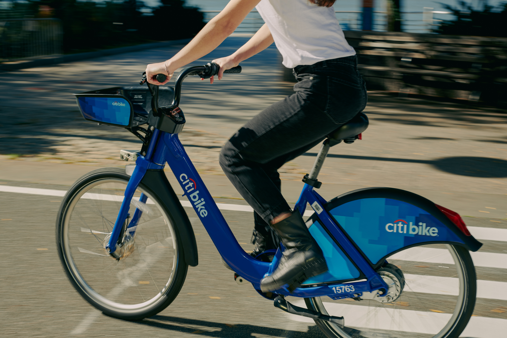
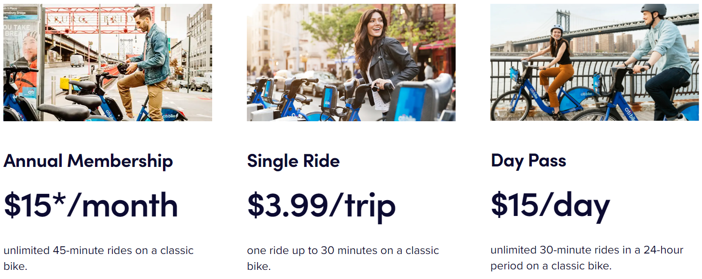
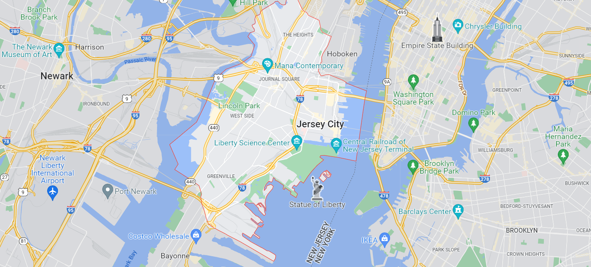
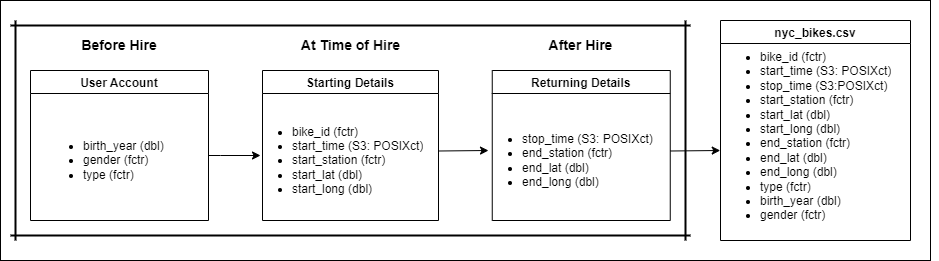
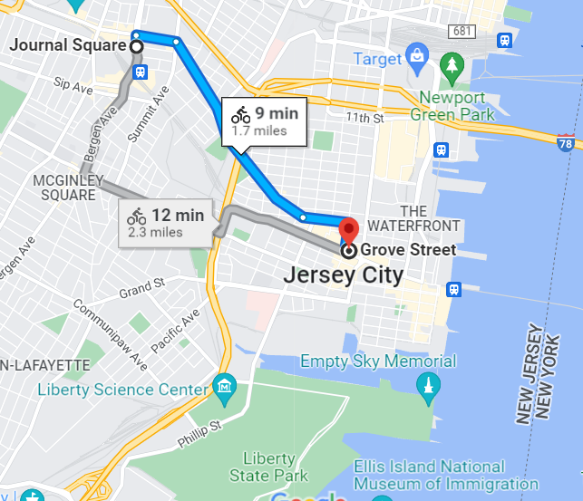

<br>

# 1. Documentation

## Domain knowledge (1.1) 

Since launching in May 2013 with 6000 bikes and 5000 members, Citi Bike is now
the United State's largest bike share program. 

By July 2020, their customers had taken *over 100 million trips*, and today they 
have 20,000 bikes across 1,300 stations in Manhattan, Brooklyn, Queens, the 
Bronx, and Jersey City.

<br>


<br>

They offer a range of passes to cyclists who wish to enjoy quick trips in 
a fun and affordable way, including the annual pass which allows you unlimited 
45 minutes rentals, or day and single trip passes which each allow for 30 
minutes of cycling. 

Should you go over your 30 or 45 minutes, there is a small charge per minute 
until you return and dock your bike at one of their stations (you can return to 
any station that conveniences you).

<br>



<hr>
<br>

**This data covers the Jersey City area and contains information on:**

* A sample from NYC Citi Bike usage of 10 bikes throughout 2018
* Event data on each trip, including the trip's start and end times and locations
* The customer's gender and birth year
* The type of trip: 
  * *"Customers"* are those who have purchased a 1 or 3 day pass, and
  * *"Subscribers"* are those who have purchased an annual subscription

<br>

**This dataset contains information from:**

        930 women                3,069 men               

{width=20%} {width=20%} 

<br>

    3,953 "subscribers"       315 "customers"
      
{width=20%}   {width=20%}

<br>

These numbers don't match the total rows (N = 4268) because there were a few
odd entries that were removed for analysis purposes. This is discussed later in 
this project. 

<hr>
<br>

**For customer protection when considering data ethics:**

* This dataset is provided according to the Citi Bike Data Use Policy.
* Citi Bike provides monthly reports to the NYC Department of Transportation with 
the intention of being open and transparent with their customers and the residents 
of the City of New York.
* The data is minimised and anonymised to protect customer identity and personal 
behaviours:
  * Though the customer's birth year and gender is recorded in the data set, no 
  personal identifiers such as name, address, or contact details are present. 
  * Each journey is recorded under the bike ID rather than a customer ID.
  * Though it is noted whether a customer is a "subscriber" or "customer", there 
  are no records of payment or any bank details. 

<hr> 
<br>

**Jersey City**

<br>
  

<br>

Jersey City is separated from New York by the Hudson River with ferries and 
trains connecting the two; especially handy for commuters who might work in the 
busy business and financial districts. 

With a lively downtown area, visitors also come to Jersey City to explore 
Liberty State Park for panoramic views of the Manhattan Skyline, the Ellis 
Island Immigration Station, and the Statue of Liberty. 

Citi Bike suggest a popular cycling route that takes in all of these views 
(across a few hires, but doable in a day).

<br>

 

<hr>
<br>

## Business requirements (1.2)

Having researched the company as well as Jersey City, I plan to decipher the 
most popular areas for bike hire and return, as well as the most popular days of 
the week, to see if there are possible commuter/visitor clues that can be 
further looked into. Additionally, gender and age would be of interest with 
thoughts of targeting marketing at the most popular demographics. 

With a view to providing actionable insights with the overall objective of 
increasing bike hires, this report follows the below steps: 

* Preparing (wranggling) and investigating the data set for analysis and 
visualisation 
* Identifying and investigating variables of interest and their relationships
with each other with the use of visualisations 
  * Focusing on patterns of bike hire over time
  * Considering whether patterns differ between rider demographics
  * Viewing the geographical spread of starting stations for bike hires 
* Ensuring that insights convey a clear and accurate message for the business 

<hr>
<br>

## Business processes and data flow (1.3)



<hr> 
<br>

## Data visualisation as a tool for decision-making (1.4)

With consideration of user demographics as well as stations that are used most
often for both rental and return, Citi Bikes can tailor their marketing to 
the most appropriate potential customers with the intention of increasing their 
bike hires throughout the year. 

Further, they could look into stations that may require more or fewer bikes due 
to user numbers. This would be especially useful at this time as it is reported 
that the system has become more popular throughout the COVID pandemic and more
people are returning to their offices having been working from home. 

<hr>
<br>

## Data types (1.5)

Across the 12 variables, the data types are as follows:

_Factor_

* A factor is a categorical variable that stores both string and integer data 
values as levels.
  * `bike_id`
  * `start_station` and `end_station`
  * `type`
  * and `gender` are all _factor_ variables. 
  
_Datetime_

* Datetime variables can store calendar dates and times to the microsecond. 
  * `start_time` and `stop_time` are _datetime_ variables.

_Double_

* This is a numeric data type that holds real numbers with at least 2 decimal 
places, e.g. 2.00
  * `start_lat` and `start_long` 
  * `end_lat` and `end_long` 
  * and `birth_year` are all _double_ variables.


<hr>
<br>

## Data quality and data bias (1.6)

There are far more men (n = 3069) than women (n = 930), and 269 customers gender
is recorded as "unknown". This is not a huge concern as it may give insight 
into future marketing. Having looked into those with gender as "unknown" however, 
243 out of 267 customers were recorded as being 49 years old. Further 
investigation into those aged 49 years revealed that 180 were recorded as a
"customer" (1 or 3 day pass users) out of a total of 315 "customer" records. 
Something may have happened in the retrieval of this data as these figures seem 
unlikely. When considering differences between gender usage, those with "unknown" 
were therefore removed from the data set before analysis. 

A couple of users are recorded as being born in the 1880s. They are both 
subscribers but also have no gender attached to themselves and only have one 
record each. I therefore removed these from the data set so that they do not 
skew the data. 

Following just 10 bikes may not present a big enough picture - especially 
considering there are 82 stations in Jersey City and nearby Hoboken. 
Further, only the year 2018 is recorded - cyclical or seasonal patterns may 
therefore not be fully appreciated. 

___
<br>

# 2. Data cleaning

## Preparing data for visualisation (1.7)

<br>
**Libraries Used:**
```{r}
library(tidyverse)
library(tsibbledata)
library(tsibble)
library(lubridate)
library(ggplot2)
library(ggthemes)
library(sf) 
library(rgeos)
library(rnaturalearth)
library(rnaturalearthdata)
library(leaflet)
```

<br>

**Load and view the data set:**
```{r}
nyc_bikes_df <- tsibbledata::nyc_bikes
nyc_bikes_df

# glimpse(nyc_bikes_df)
# view(nyc_bikes_df)
# There are 4,2688 rows initially but 4,266 after removing two users who are
# recorded as being born in 1880s
```
<br>

**Adding columns**

1. Adding columns: start day of the week, month, time
2. Creating a column that shows the season just in case
3. Creating a column for age of rider and removing two outliers (born 1880s)
4. Showing hire duration (2 were hired for 3 days and the rest less than a day.
Most were hired for less than 50 mins)
```{r}
#creating 4 columns: date, and start day, month and hour
nyc_bikes_df <- nyc_bikes_df %>% 
  mutate(date = as_date(start_time), .after = 2,
         start_day = wday(start_time, label = TRUE, abbr = FALSE),
         start_month = month(start_time, label = TRUE, abbr = FALSE),
         start_hour = hour(start_time), minute(start_time))

nyc_bikes_df <- nyc_bikes_df %>% 
  unite(start_hire_time, 
        start_hour, `minute(start_time)`, 
        sep = ":", 
        remove = FALSE)

#adding a season column just in case
nyc_bikes_df <- nyc_bikes_df %>% 
  mutate(season = case_when(
    start_month %in% c("December", "January", "February") ~ "Winter",
    start_month %in% c("March", "April", "May") ~ "Spring",
    start_month %in% c("June", "July", "August") ~ "Summer",
    start_month %in% c("September", "October", "November") ~ "Autumn",
    ), .after = 5)

# showing duration of hire (2 were hired for 3 days and the rest less than a day
# most were hired for less than 50 mins)
nyc_bikes_df <- nyc_bikes_df %>% 
  mutate(hire_duration = stop_time - start_time, # this shows 1.50(= 1min 30sec)
         length_of_hire_rounded = as.period(round(stop_time - start_time)), 
         hours_hired = as.numeric(length_of_hire_rounded, "hours")
  )

#Finding people's ages in 2018 - 2018 was the year the data was collected
nyc_bikes_df <- nyc_bikes_df %>% 
  mutate(age_years = as.numeric(2018 - birth_year))  

# There are two rows where the customer is born in the 1880s. That can not be
# right so I am removing those two rows (neither has a gender either)
nyc_bikes_df <- nyc_bikes_df %>% 
  filter(birth_year > 1900)
nyc_bikes_df
```
<br>

**Looking at subscribers, customers and unknown genders:**

* 3951 are subscribers 
* 315 are customers
* 267 have gender = "unknown" and I noticed that most are 49 years old (n = 243)
* 49 year olds:
  * 243/269 have gender unknown (26 have a gender)
  * 89/269 are subscribers, the rest (180) are customers (out of 315 in total)
```{r}
# 3951 are subscribers 
nyc_bikes_df %>% 
  filter(type == "Subscriber")

# 315 are customers
nyc_bikes_df %>% 
  filter(type == "Customer")

# 267 have gender = "unknown" and I noticed that most are 49 years old (n = 243)
nyc_bikes_df %>% 
  filter(gender == "Unknown" & age_years == 49)

# 49 year olds:
# 243/269 have gender unknown (26 have a gender).
# 89/269 are subscribers, the rest (180) are customers (out of 315 in total)
age49 <- nyc_bikes_df %>% 
  filter(age_years == 49)
```

___
<br>

# 3. Data visualisation

## Process and design (2.1, 2.7, 2.8, 2.9)

All visualisations were made in RStudio using the `ggplot` package. Having 
picked up on possible areas of interest during the wrangling process, I 
investigated patterns of bike hire over time simply by looking at distribution 
plots of the days of the year, days of the week, and differences in months. 
I then considered demographics such as age and gender as well as looking into 
the proportion of "customers" against "subsribers". Finally, geographical 
consideration was given to the spread of the start points of bike hire and 
returns. Having selected key visualisations, I considered their aesthetics and 
degree of accuracy with the hope of conveying appropriate messages and providing
insight in the business context. 

<hr>
<br>

## Visualisations (2.2, 2.3, 2.4, 2.5, 2.6)

### Patterns Across Time
<br>

Looking at the total hires per day across the year:
```{r}
count_per_day <- nyc_bikes_df %>% 
  group_by(date) %>% 
  summarise(rentals_per_day = n()) %>% 
  arrange(desc(rentals_per_day))

count_per_day %>% 
  ggplot()+
  aes(x = date, 
      y = rentals_per_day)+
  geom_line() + 
  labs(x = "\nDays in 2018",
       y = "Total number of rentals per day",
       title = "Total number of bike rentals per day",
       subtitle = "For every day in the year 2018")+
  theme_bw()
```

<br>

From the line graph above, we can see the variation in total number of bike 
rentals per day across the year 2018. 

An increase in total rentals per day can be seen as the graph moves from winter 
into summer (the highest spike is on 31st July, a Tuesday) and then total hires
decrease again as we head into autumn and winter again. 

<br>

Though a trend can be seen, it is a bit messy. To look at it another way we 
can look at the total bikes rented per month:

```{r}
count_per_month <- nyc_bikes_df %>% 
  group_by(season, start_month) %>% 
  summarise(rentals_per_month = n()) %>% 
  arrange(desc(rentals_per_month))

count_per_month %>% 
  ggplot()+
  aes(x = start_month, 
      y = rentals_per_month) +
  geom_col(fill = "#007cb9")+
  theme_bw()+
  theme(axis.text.x = element_text(angle = 45, 
                                   hjust = 0.9))+
  geom_text(aes(label = rentals_per_month),
    position = position_dodge(0.9),
    vjust = 0)+ 
  labs(x = "\nMonth (in 2018)", 
       y = "Total rentals per month", 
       title = "Total Bike Rentals per Month in 2018")
```

<br>

Following the same pattern as the previous line graph, this graph shows an 
increase in total bike rentals per month from winter into summer with the most
rentals in August. Following on from this, there is a sharp decrease as 
autumn and winter arrive. 

The business may wish to consider furthering these two graphs by looking into 
seasonal and yearly cycles so as to more accurately predict customer behaviour 
throughout the year and by season.

<br>

With an interest in considering patterns of bike hire over days of the week, the 
below graph shows the days of the week, also the day individual bikes were 
hired, against the total number of bikes hired on each day throughout the year:

```{r}
weekdays <- c("Monday", "Tuesday", "Wednesday", "Thursday", 
              "Friday", "Saturday", "Sunday")

#Tues: 720!, Fri 658, Wed, Thurs, Mon 628, Sat 523, Sun(453!))
bikes_per_day <- nyc_bikes_df %>% 
  group_by(start_day) %>% 
  summarise(num_of_bikes_hired = n()) %>% 
  arrange(desc(num_of_bikes_hired))

bikes_per_day %>%  
  ggplot(aes(x = start_day, 
             y = num_of_bikes_hired))+
  scale_x_discrete(limits = weekdays) +
    geom_col(fill = "#007cb9")+
  theme(axis.text.x = element_text(angle = 45, 
                                   hjust = 0.9))+
  geom_text(aes(label = num_of_bikes_hired),
    position = position_dodge(0.9),
    vjust = 0) +
  labs(
    x = "\nDay of hire", 
    y = "Total number of bikes hired throughout the year", 
    title = "Total number of bikes hired by weekday in 2018"
  )
```

<br>

Here we can see that, overall, weekdays are more popular for bike hire than 
weekends. 720 bikes were hired on Tuesdays compared with 453 on Sundays. Was 
this the case every month? 

It would be interesting to see if this is a pattern across the year as it may 
point to customer usage, i.e. are more customers commuters or hiring for 
leisure: 

```{r}
monthly_bikes_per_day <-nyc_bikes_df %>% 
  group_by(start_month, start_day) %>% 
  summarise(num_of_bikes_hired = n())

monthly_bikes_per_day %>% 
  ggplot()+
  aes(x = start_day, 
      y = num_of_bikes_hired, 
      fill = start_day)+
  scale_x_discrete(limits = weekdays) +
  geom_col(fill = "#007cb9") + 
  facet_wrap(~start_month)+
  theme_bw()+
  theme(axis.text.x = element_text(angle = 45, 
                                   hjust = 0.9))+
  labs(
    x = "\nDay of hire", 
    y = "Total number of bikes hired", 
    title = "Total number of bikes hired by day in each month in 2018")

```

<br>

Though not terribly easy to decipher, it is clear that almost all months show
that weekends see similar or fewer bike hires than weekdays throughout the year. 

Further research could be undertaken to try and determine the type of user hiring 
Citi Bikes, possibly by asking customers their main purpose for signing up when 
they do so. 

<br>

With the information we have on start times, we can start to gather ideas as 
to what kind of users sign up to Citi Bike. Are people mostly travelling at 
commuting times? Let's look at the full year:
```{r}
time_of_ride <- nyc_bikes_df %>% 
  group_by(start_hour) %>% 
  summarise(count = n()) %>% 
  arrange(desc(count))

time_of_ride %>% 
  ggplot()+
  aes(x = start_hour, 
      y = count)+
  geom_col(fill = "#007cb9")+
  theme_bw()+
  geom_text(aes(label = count),
    position = position_dodge(0.9),
    vjust = 0)+
  scale_x_continuous(breaks = c(0, 2, 4, 6, 8, 10, 12, 
                                14, 16, 18, 20, 22, 24)) + 
  labs(x = "\nHire Start Time (24hr clock)", 
       y = "Total number of hires", 
       title = "Total number of hires by hour across the year 2018")

```

<br>

And again, seeing if this is a pattern across the months of the year:

```{r}
#month
time_of_ride_by_month <- nyc_bikes_df %>% 
  group_by(start_month, start_hour) %>% 
  summarise(count = n()) %>% 
  arrange(desc(count))

time_of_ride_by_month %>% 
  ggplot()+
  aes(x = start_hour, 
      y = count)+
  geom_col(fill = "#007cb9")+
  facet_wrap(~start_month)+ 
  theme_bw() +  
  scale_x_continuous(breaks = c(0, 4, 8, 12, 
                                16, 20, 24)) + 
  labs(x = "\nHire Start Time (24hr clock)", 
       y = "Total number of hires", 
       title = "Total number of hires by hour across months of the year 2018")
```

<br>

Without exception, we can see that morning and afternoon/evening peak commuting 
hours are the most popular for bike hire in each month of the year. Again, 
if a reason for hire was given by customers, this could be further looked into 
and marketing strategies could be influenced by such information or the company 
could look into whether they have the appropriate number of bikes at each 
station. 

<br>
<hr>

### Patterns Across Demographics

#### Gender

* There are 3,069 males, 930 females, 267 unknown (243 of them are "49" years old)
* There are 3,999 rows when taking out gender unknown (as described in Data 
Quality and Data Bias (1.6))
```{r}
nyc_bikes_df %>% 
  group_by(gender) %>% 
  summarise(count = n())

minus_gender_unknown <- nyc_bikes_df %>% 
  filter(gender %in% c("Male", "Female"))
```
<br>

Looking at total rentals per month based on gender:
<br>
```{r}
rentals_by_month_and_gender <- minus_gender_unknown %>% 
  group_by(start_month, gender) %>% 
  summarise(rentals_per_month = n()) 

rentals_by_month_and_gender %>% 
  ggplot()+
  aes(x = start_month, 
      y = rentals_per_month, 
      group = gender, 
      colour = gender)+
  geom_point()+
  geom_line() +
  scale_color_manual(values = c("Male" = "#007cb9", "Female" = "#ED2E14"))+
  theme(axis.text.x = element_text(angle = 45, 
                                   hjust = 0.9))+
  geom_label(aes(label = rentals_per_month),
    position = position_dodge(1),
    vjust = 0) +
  labs(
    x = "\nMonth in 2018", 
    y = "Total rentals", 
    title = "Total rentals per month in 2018 based on gender", 
    colour = "Gender"
  )
```

<br>

Firstly, there are far more males than females using Citi Bikes, again this 
information could be considered by the business in order to concentrate 
promotions on the most appropriate demographic and at the more appropriate time 
of year. 

Males and females follow a similar pattern as rentals are seen to increase
as the months move from January towards August, and then decrease again as we 
enter the colder autumn and winter months. 

<br>

Further research of the data also showed that male and female patterns were 
similar between months of the year and starting stations. However, as can be 
seen below, where males tend to use Citi Bikes more on weekdays, females have 
a more consistent usage across the week (though if there were more female 
customers, these patterns may have started to reflect each other):

```{r}
day_by_gender <- minus_gender_unknown %>% 
  group_by(start_day, gender) %>% 
  summarise(daily_users = n())

day_by_gender %>% 
  ggplot(aes(x = start_day, 
             y = daily_users, 
             fill = gender))+
  scale_x_discrete(limits = weekdays) +
  geom_col(position = "dodge")  +
  scale_fill_manual(values = c("Male" = "#007cb9", "Female" = "#ED2E14"))+
  theme(axis.text.x = element_text(angle = 45, 
                                   hjust = 0.9))+
  geom_text(aes(label = daily_users),
    position = position_dodge(0.9),
    vjust = 0)+ 
  labs(
    x = "Day of hire",
    y = "Total number of hires",
    title = "Total number of bike hires by gender across days of the week in
    the year 2018", 
    fill = "Gender"
  )
```

<br>
<hr>

#### Age

Customers range from 19 to 71 years old, the below graph shows the total number 
of bikes hired per age in years in 2018.

```{r}
minus_gender_unknown %>% 
  group_by(age_years, gender) %>% 
  ggplot()+
  aes(x = age_years, 
      fill = gender) +
  geom_bar()  +
  scale_fill_manual(values = c("Male" = "#007cb9", "Female" = "#ED2E14"))+
  labs(
    x = "\nAge in years",
    y = "Total number of Citi Bike customers",
    title = "Total number of Citi Bike customers of each age (in years)",
    subtitle = "Separated by gender", 
    fill = "Gender"
  )
```
 <br>
 
Citi Bikes could use this information to consider where best to promote their 
service and to see if they need to add more bikes to any locations to cater to 
the age demographics as they are. 

As a large proportion of customers are in the 25-35 year bracket, specific media 
channels and venue advertisements could be considered along with targeted offers.

<br>
<hr>
 
### Georgraphical Spread 

```{r}
# how many bikes from each station (52 start stations): 
bikes_per_start_station <- nyc_bikes_df %>% 
  group_by(start_long, start_lat, start_station) %>% 
  summarise(total_hires = n(), 
            average_duration = round(mean(hire_duration))) %>% 
  arrange(desc(total_hires))

# 55 end stations
bikes_per_end_station<- nyc_bikes_df %>%
  group_by(end_long, end_lat, end_station) %>% 
  summarise(total_returns = n(), 
            average_duration = round(mean(hire_duration))) %>% 
  arrange(desc(total_returns))
```

<br>
There are 52 different stations recorded as start stations, and 55 as return
stations. 

The two visualisations below show each station with a radius circle representing
how often the station is used. The wider the radius, the more popular the 
station. Clicking on each station will give information regarding the station
code, the total number of hires (or returns, depending on which you are looking 
at) from that station, and the average journey length in minutes. 

<br>
**Starting Stations**

```{r}
bikes_per_start_station %>% 
  leaflet() %>% 
  addTiles() %>% 
  addCircleMarkers(lng = ~start_long, 
                   lat = ~start_lat,
                   radius = ~total_hires/10,
                   popup = ~paste0("Start Station: ", start_station, 
                                   "<br> Total Hires: ", total_hires, 
                                   "<br> Average Duration: ", average_duration, 
                                   " mins"))
```

<br>

**Return Stations**

```{r}
bikes_per_end_station%>% 
  leaflet() %>% 
  addTiles() %>% 
  addCircleMarkers(lng = ~end_long, 
                   lat = ~end_lat,
                   radius = ~total_returns/10,
                   popup = ~paste0("End Station: ", end_station,
                                   "<br>Total Returns ", total_returns, 
                                   "<br> Average Duration: ", average_duration, 
                                   " mins"))
```

<br>

**The Most Popular Starting Stations:**

*These are also the most popular return stations however the return order is:*
*1, 4, 2, 3, 5.*

1. **3186**  -  *Grove Street Rail Station*   
  This is the bustling downtown area with trains leaving for and arriving
  from the Newark Financial District to the West and New York City to the East.

2. **3203**  -  *Hamilton Park*
  A tranquil and green neighborhood in the Downtown area.
  
3. **3195**  -  *Journal Square* 
  Busy business district, residential area, and transport hub (9 min cycle 
  from Grove Street Station as can be seen in the picture below).
  
4. **3183**  -  *Exchange Place* 
  The Jersey City Financial District know as "Wall Street West", this area is
  also busy with ferries leaving and entering surrounding piers across the 
  Hudson River. 
  
5. **3203**  -  *Newport*
  A mixed use community area. 

<br> 



<br>
<hr>

### Duration

The analysed data could potentially be pointing towards commuters using the 
service more than casual customers. 

When considering total journey time below, we can see that the majority of
journeys are complete within 10 minutes. 

<br>
```{r}
duration <- nyc_bikes_df %>% 
  group_by(length_of_hire_rounded) %>% 
  summarise(count = n()) %>% 
  arrange(desc(count)) 

a <- nyc_bikes_df %>% 
  mutate(duration_block = case_when(
    length_of_hire_rounded <= "5M 0S" ~ "0 - 5", 
    length_of_hire_rounded <= "10M 0S" & 
      length_of_hire_rounded > "5M 0S" ~ "5 - 10",
    length_of_hire_rounded <= "15M 0S" & 
      length_of_hire_rounded > "10M 0S" ~ "10 - 15",
    length_of_hire_rounded <= "20M 0S" & 
      length_of_hire_rounded > "15M 0S" ~ "15 - 20",
    length_of_hire_rounded <= "25M 0S" & 
      length_of_hire_rounded > "20M 0S" ~ "20 - 25",
    length_of_hire_rounded <= "30M 0S" & 
      length_of_hire_rounded > "25M 0S" ~ "25 - 30",
    length_of_hire_rounded <= "35M 0S" & 
      length_of_hire_rounded > "30M 0S" ~ "30 - 35",
    length_of_hire_rounded <= "40M 0S" & 
      length_of_hire_rounded > "35M 0S" ~ "35 - 40",
    length_of_hire_rounded <= "45M 0S" & 
      length_of_hire_rounded > "40M 0S" ~ "40 - 45",
    length_of_hire_rounded <= "50M 0S" & 
      length_of_hire_rounded > "45M 0S" ~ "45 - 50",
    length_of_hire_rounded <= "55M 0S" & 
      length_of_hire_rounded > "50M 0S" ~ "50 - 55",
    length_of_hire_rounded <= "60M 0S" & 
      length_of_hire_rounded > "55M 0S" ~ "55 - 60",
    length_of_hire_rounded <= "3H 0S" & 
      length_of_hire_rounded > "1H 0S" ~ "1Hrs - 3Hrs",
    length_of_hire_rounded > "3H 0S" ~ "3Hrs plus",
  ))


durations <- a %>% 
  group_by(duration_block) %>% 
  summarise(count = n()) 

time_blocks <- c("0 - 5", "5 - 10", "10 - 15", "15 - 20", "20 - 25", "25 - 30",
                 "30 - 35", "35 - 40", "40 - 45", "45 - 50", "50 - 55", 
                 "55 - 60", "1Hrs - 3Hrs", "3Hrs plus")

durations %>%   
  ggplot()+
  aes(x = duration_block, 
      y = count) +
  scale_x_discrete(limits = time_blocks) +
  geom_col(fill = "#007cb9")+
  theme_bw()+
  theme(axis.text.x = element_text(angle = 45, 
                                   hjust = 0.9))+
  labs(
    x = "Length of Trip (mins)",
    y = "Total number of hires",
    title = "Total number of bike hires per journey time 
    in blocks of 5 minute intervals",
  )+
    geom_text(aes(label = count),
    position = position_dodge(0.9),
    vjust = 0)

```

<br>
Citi Bikes are clearly very popular for short journeys across Jersey City. 
Though, of course, more information needs to be gathered, it may be considered 
that the bikes are used for commuting purposes, maybe for shopping trips, or for 
people visiting the Downtown area for the evening. 

<hr>
<br>

## Conclusions

* The busiest periods are in the summer months and at peak commuting times every 
month of the year.

*  More often than not, weekdays are more popular than weekends - though is this
the case with female customers? More female records may need to be gathered. 

* The age range is 19-71 however 25-35 year olds appear to hire bikes more often
than others.

* Most journeys are short, very often less than 10 minutes, and the busiest rental 
and drop off stations appear to be in the business, financial, and transport
hub areas of Jersey City. 

* All of this could guide the business into maintaining or improving upon 
marketing strategies - promoting to the right people at the right time and in 
the right place. 

* They could also look at seasonal and cyclical patterns over a longer period to 
better predict customer trends.

* They may wish to look into the data further to consider the volume of bikes 
available at their most and least popular stations. 